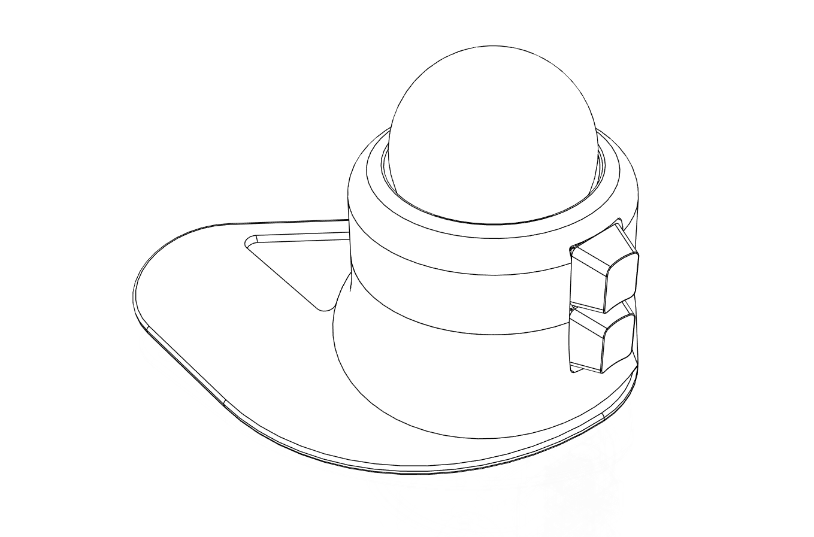
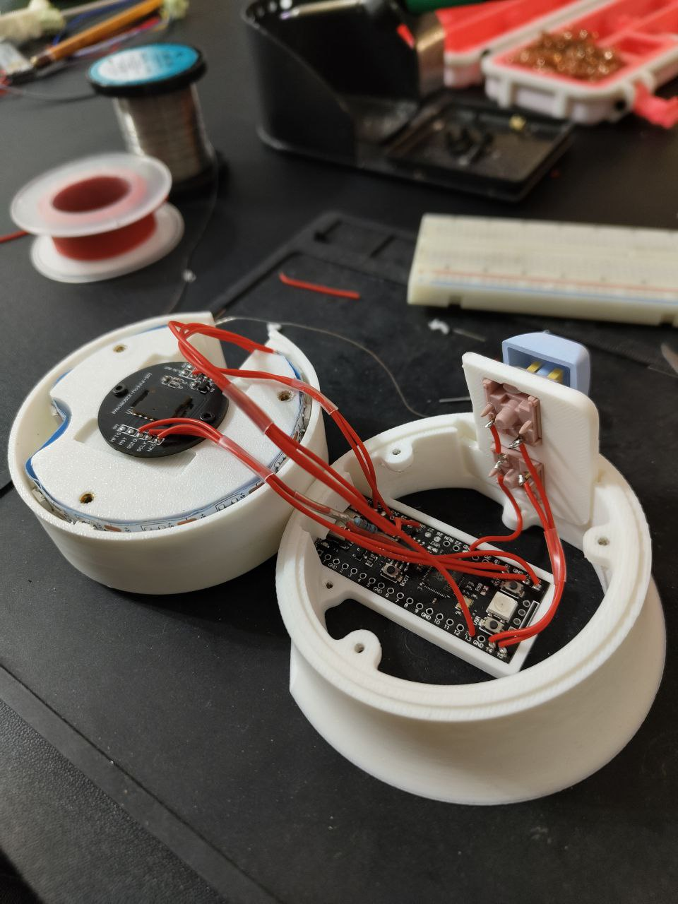

# trackball55

Open source trackball project for PAW3805EK-CJV1 sensor.    
My idea to make cheap adjustable solutions for new ballers (idk how its called).  

I'm more hardware engineer than programmer, so will appreciate any help in development or suggestions. For now vibe code something working with GPT, but later want to rewrite everything and maybe move from arduino, also there is problem with horizontal scroll.

### Current fucntionality
- Mouse mode
- Left mouse click
- Right mouse click (when held trackball enters scroll mode)
- Scroll mode vertical scroll and left/right arrow for horizontal movements
- Led animation for different states

### Main components list
- [PAW3805EK-CJV1 aliexpress ~12.35$](https://aliexpress.ru/item/1005006306592503.html?spm=a2g2w.orderdetail.0.0.467d4aa6BD8HBg&sku_id=12000036695485298&_ga=2.89872158.441509916.1754381694-1577428535.1744108925)   
- [Track 55mm aliexpress ~12.35$](https://aliexpress.ru/item/1005006306592503.html?spm=a2g2w.orderdetail.0.0.467d4aa6BD8HBg&sku_id=12000036695485298&_ga=2.89872158.441509916.1754381694-1577428535.1744108925)  
- [Roller bearing SP8 PL/CS (SP8 B-D) ozon ~2.54$](https://www.ozon.ru/product/sharikovaya-opora-sp8-pl-cs-sp8-b-d-zhlru-1644244051/?oos_search=false)

### Wiring
In current implementation I use *YD-RP2040 by VCC-GND Studio* but plant to migrate to something wireless  
Model split into several easy replaceable components for different types of electronics  

To wire it I use (add wiring scheme later):  
- [PAW3805EK-CJV1 datasheet](https://www.codico.com/en/mpattachment/file/download/id/951/)  
- [YD-RP2040 pinout](https://ae01.alicdn.com/kf/S78352c36f317459395bbb0b8952866904.png)        

   

### Installation
1) First u neeed to clone this repo
2) The set [Ardino additional URL for YD-RP2040 board](https://github.com/earlephilhower/arduino-pico/releases/download/global/package_rp2040_index.json)   
3) Connect contoller and upload code via Arduino IDE
